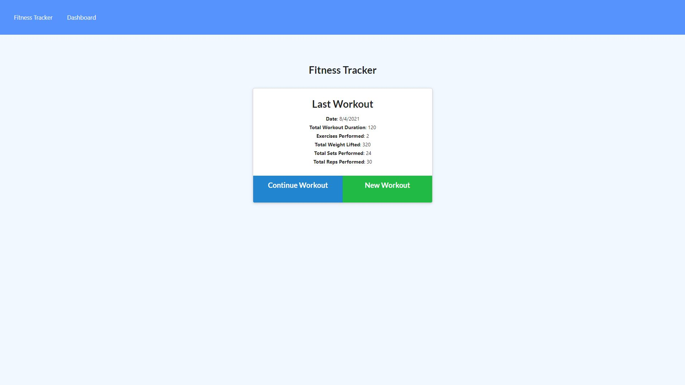
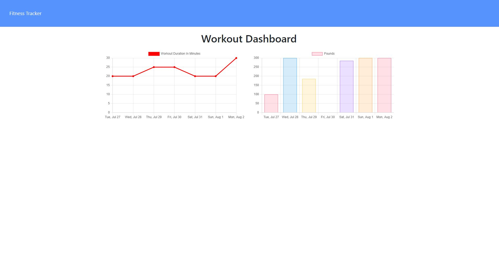
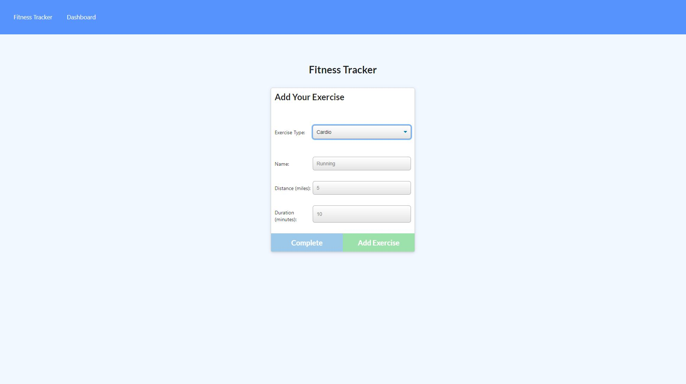
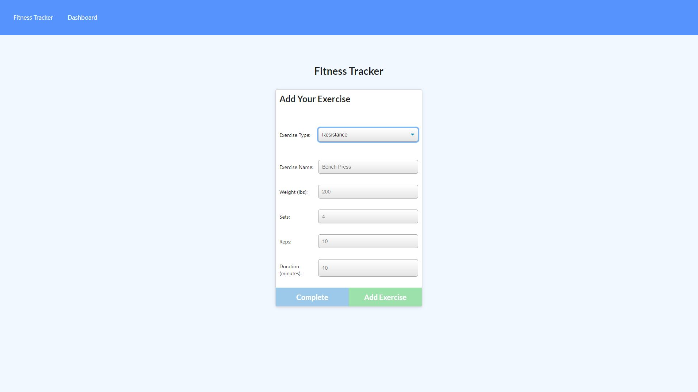

# Workout-Tracker

## Description
This is a fullstack app developed in node.js that uses express.js with mongoose to handle back end database management. The purpose of the app is to keep track of the workouts that a user does within a week. The user can update the most recent workout as well as create a new workout with multiple exercises. There is a stats page that displays graphs showing data for the past 7 workouts.

 

## Images

**Above is an image of the webpage upon launching it**

 

**Above is an image of the stats section of the webpage**

 

**Above is an image of adding a cardio exercise to the currently selected workout**

 

**Above is an image of adding a resistance exercise to the currently selected workout**

 

## Installation and Operation
In order to run this app, the user must first clone the repo locally and then navigate into the cloned repo. Once in the cloned repo, run `npm install`. The user can then seed the database by running `node seeders/seed.js`. After the previous steps have been completed, then the server can be started using `node server.js`. From there the user can access the webpage by going into their browser of choice and navigate to `localhost:3000`. For simplicity, the user can also access a fully working version of this app through the deployment link below.

 

## Deployment Link
https://shrouded-beyond-17064.herokuapp.com/